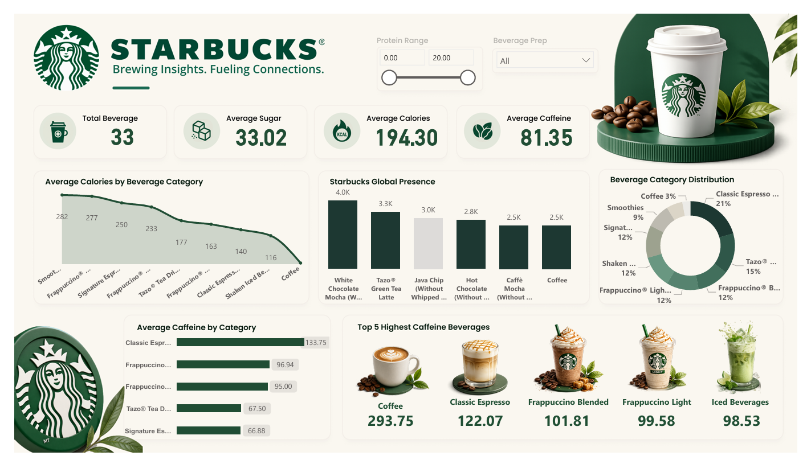

# ☕ Starbucks Beverage Analytics Dashboard

<p align="center">
  
</p>

## 📊 Overview

A visually appealing and interactive Power BI dashboard built using Starbucks beverage data to analyze nutritional information, beverage categories, and beverage distribution.

## 🎯 Project Objective

The goal of this dashboard is to provide insights into Starbucks beverages by analyzing:

- Total number of beverages
- Average calories
- Average sugar content
- Average caffeine content
- Beverage category distribution
- Top caffeine-rich beverages

## 🔑 Key Metrics

| Metric | Value |
|----------|----------|
| Total Beverages | 30 |
| Average Sugar | 30.94 g |
| Average Calories | 173 |
| Average Caffeine | 78.17 mg |

## 📈 Dashboard Features

- KPI Cards
- Interactive Slicers
- Line Charts
- Bar Charts
- Donut Charts
- Beverage Category Analysis
- Top 5 Highest Caffeine Drinks

## 🛠️ Tools Used

- Power BI
- Power Query
- DAX
- Excel

## 🚀 Skills Demonstrated

- Data Cleaning
- Data Transformation
- Data Modeling
- DAX Measures
- Dashboard Design
- Business Intelligence Reporting

## 📂 Project Structure

```text
├── Data/
│   └── Starbucks_Beverages.xlsx
├── Dashboard/
│   └── Starbucks_Dashboard.pbix
├── Images/
│   └── dashboard.png
└── README.md
